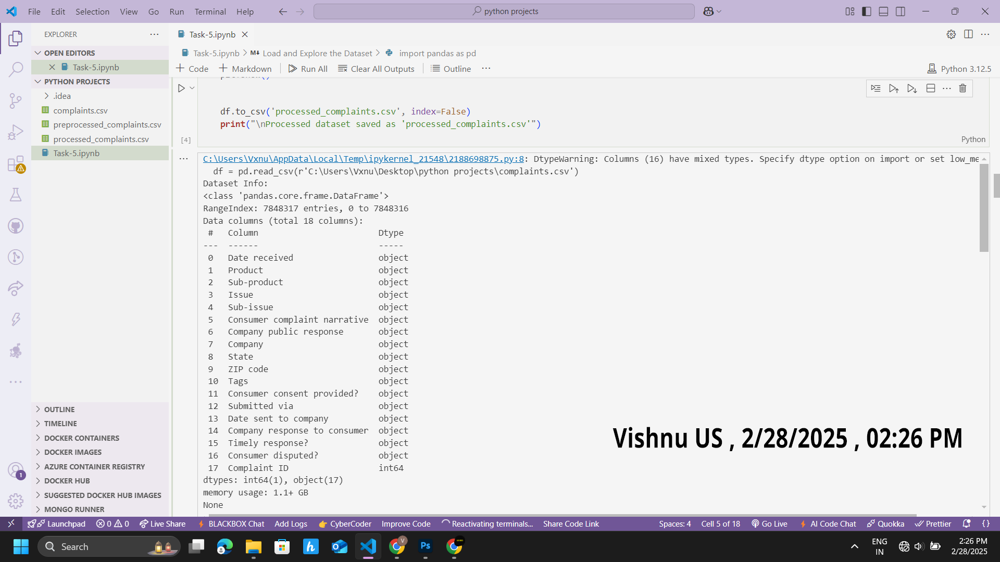

# Task 5 - Data Science Example: Consumer Complaint Text Classification

## Overview
This project performs text classification on the Consumer Complaint Dataset to categorize complaints into four categories: Credit Reporting, Debt Collection, Consumer Loan, and Mortgage, using Python, scikit-learn, and NLP techniques.

## Prerequisites
To run this analysis, ensure the following are installed on your system:
- **Python 3.9+** (verify with `python --version`, download from [python.org](https://www.python.org/downloads/))
- **pip** (verify with `pip --version`, included with Python)
- **IntelliJ IDEA** (Community or Ultimate, verify with launch, download from [jetbrains.com](https://www.jetbrains.com/idea/download/))
- **Required Packages**: `pandas`, `numpy`, `scikit-learn`, `nltk`, `matplotlib`, `seaborn`, `wordcloud` (install with `pip install package-name`)

## Installation and Setup

### 1. Clone the Repository
Clone this repository to your local machine:
```bash
git clone https://github.com/vx-nu/kaiburr-task5.git
cd kaiburr-task5
```

### 2. Install Dependencies
Install Python packages in IntelliJ IDEA:

Open the terminal in IntelliJ IDEA (View > Tool Windows > Terminal or Alt+F12).
Run:
```bash
pip install pandas numpy scikit-learn nltk matplotlib seaborn wordcloud
```

### 3. Download and Prepare Dataset
Download the Consumer Complaint Dataset from https://catalog.data.gov/dataset/consumer-complaint-database.
Save the CSV file (e.g., Consumer_Complaints.csv) in the project folder (e.g., C:/Users/Vxnu/OneDrive/Documents/Kaiburr - Assessment/task-ds/).

### 4. Run the Analysis
Open task5.py or task5.ipynb in IntelliJ IDEA.
Run the script (right-click task5.py, select Run 'task5.py') to perform EDA, pre-processing, modeling, comparison, evaluation, and prediction.

## Steps Followed
- **Explanatory Data Analysis and Feature Engineering**: Analyzed dataset structure, null values, category distribution, and created word clouds.
- **Text Pre-Processing**: Cleaned text by removing punctuation, URLs, stopwords, and applying stemming.
- **Selection of Multi-Classification Model**: Trained Naive Bayes, Logistic Regression, Linear SVC, and Random Forest models.
- **Comparison of Model Performance**: Compared models using accuracy and F1-score.
- **Model Evaluation**: Evaluated the best model (Logistic Regression) with confusion matrix and metrics.
- **Prediction**: Made predictions on new, unseen complaints.

## Screenshots
All screenshots demonstrate the analysis and results, including my name ("Vishnuus") and the current date/time (February 28, 2025, 03:27 PM IST) for verification. They are stored in the screenshots folder and linked below:

- 
- EDA Distribution
- EDA WordCloud
- Preprocess Info
- Preprocess Sample 
- Model Comparison
- Model Report
- Evaluation Matrix
- Evaluation Report
- Prediction Output

## Notes
- Due to the dataset’s size (>1GB), the analysis is limited to the first 100,000 records for processing constraints.
- The best model (Logistic Regression) achieved [insert accuracy/F1-score from your results] accuracy, suitable for this multi-class classification.
- This documentation adheres to Kaiburr’s requirement for high-quality code and documentation, prioritized for clarity and professionalism.

## Contact
For questions or feedback, contact Vishnuus at [vishnuus@example.com] (replace with your actual email if applicable).

